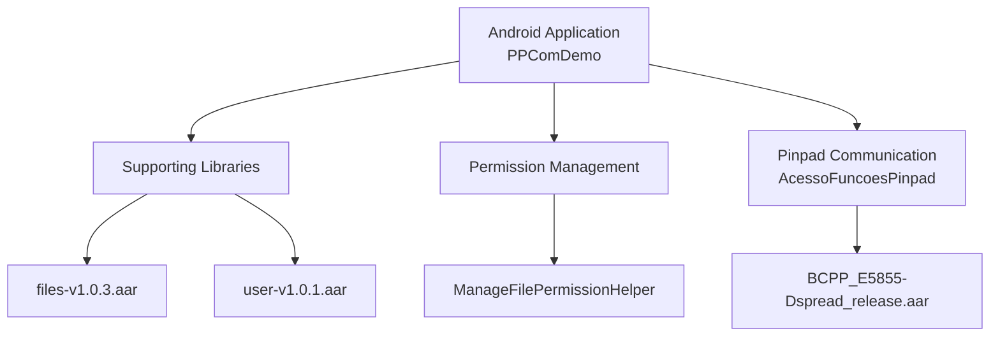
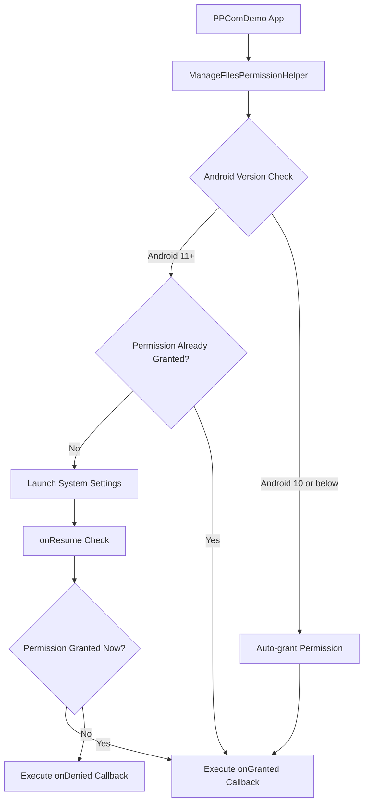
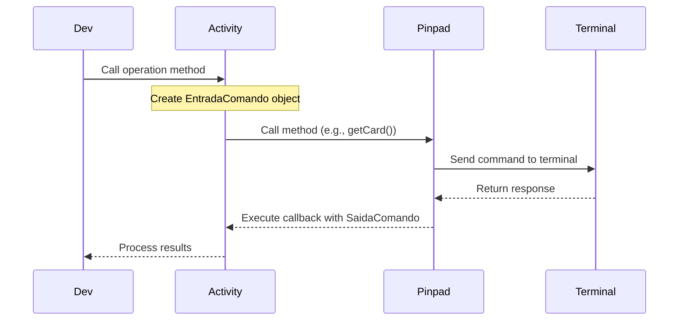
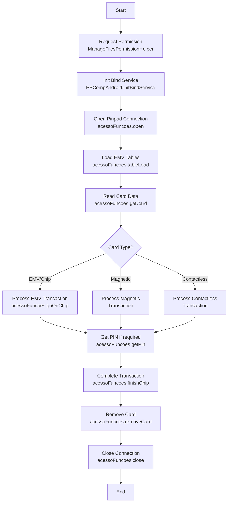

# Development Guide

This guide provides practical information for developers who want to integrate, use, or extend the Android ABECS Demo project. It covers development environment setup, project structure, and working with key components. Follow these steps to get started with the Android ABECS Demo project.


## Development Environment

The project is built using:

- Gradle build system
- Java Or Kotlin programming languages
- AAR libraries for specialized functionality:
- BCPP_E5855-Dspread_release.aar
- files-v1.0.3.aar
- user-v1.0.1.aar

The application targets Android API level 33 (Android 13) with a minimum supported level of 21 (Android 5.0 Lollipop).

## Setting Up the Development Environment

### Requirements
- Android Studio 4.0+
- Android SDK API level 30+ (for Android 11 file permission support)
- Java Development Kit (JDK) 8+
- Physical Android device for testing hardware integration


### Project Setup
1. Clone the repository from GitHub

2. Open the project in Android Studio

3. Ensure all AAR libraries in app/libs/ are properly referenced:

   - BCPP_E5855-Dspread_release.aar
   - files-v1.0.3.aar
   - user-v1.0.1.aar
4. Run Gradle sync to resolve dependencies

5. Connect a physical Android device for testing hardware integration

6. Run the application


## Project Structure

### System Components Overview


### Component Responsibilities

| Component | Primary Class | Purpose |
|-----------|--------------|----------|
| UI Layer | `WelcomeActivity` | Main interface for demo operations |
| Pinpad Communication | `AcessoFuncoesPinpad` | Interfaces with payment terminals |
| Permissions | `ManageFilesPermissionHelper` | Handles Android 11+ storage permissions |

## Managing File Permissions
Starting with Android 11 (API 30), the application requires the MANAGE_EXTERNAL_STORAGE permission for file operations. The ManageFilesPermissionHelper class handles this requirement.

### `Permission Request Flow:`


### Implementing the Permission Helper

`Request Permission:`
```java
ManageFilesPermissionHelper.requestPermission(this, new ManageFilesPermissionHelper.OnManageAllFilesPermissionResult() {
    @Override
    public void onGranted() {
        // Permission granted, initialize functionality
        PPCompAndroid.getInstance().initBindService();
    }

    @Override
    public void onDenied() {
        // Handle denied permission
        Log.e(this.getClass().getName(), "no permission granted");
    }
});
```
`Check Permission:`
Add to your Activity's onResume method:

```java
@Override
protected void onResume() {
    super.onResume();
    ManageFilesPermissionHelper.onResumeCheck();
}
```

## Working with the Pinpad Communication System

The Pinpad Communication System provides functionality for interacting with payment terminals, processing card transactions, and handling PIN entry.

### Initialization
To initialize the AcessoFuncoesPinpad instance:

```java
try {
    AcessoFuncoesPinpad acessoFuncoes = GestaoBibliotecaPinpad.obtemInstanciaAcessoFuncoesPinpad();
} catch (BibliotecaPinpadNaoEncontradaExcecao ex) {
    Log.e(TAG, ex.getMessage());
}
```

### Operation Flow
The following diagram illustrates the typical flow of a pinpad operation:



### Common Operations

#### Open Operation
Establishes connection with the pinpad device.
```java
EntradaComandoOpen entrada = new EntradaComandoOpen(new InterfaceUsuario(WelcomeActivity.this));
acessoFuncoes.open(entrada, new EntradaComandoOpen.OpenCallback() {
    @Override
    public void comandoOpenEncerrado(CodigosRetorno codigosRetorno) {
        // Handle connection result
        // Often followed by getInfo to retrieve device details
    }
});
```
#### Close Operation
Terminates connection with the pinpad device.

```java
acessoFuncoes.close(new EntradaComandoClose() {
    @Override
    public void comandoCloseEncerrado() {
        // Handle connection closure
    }
});
```

#### GetCard Operation
Retrieves card information including PAN, cardholder name, expiration date, and track data.
```java
EntradaComandoGetCard entradaComandoGetCard = new EntradaComandoGetCard
    .Builder(new Date(System.currentTimeMillis()))
    .informaIndiceAdquirente(Geral.REDECREDENCIADORA)
    .informaTipoAplicacao(tipoAplicacao)
    .informaValorTotal(valor)
    .informaTimestamp(Geral.TIMESTAMP)
    .informaPermiteCtls(true)
    .build();

acessoFuncoes.getCard(entradaComandoGetCard, new EntradaComandoGetCard.GetCardCallback() {
    @Override
    public void comandoGetCardEncerrado(SaidaComandoGetCard saidaComandoGetCard) {
        if (saidaComandoGetCard.obtemResultadoOperacao() == CodigosRetorno.OK) {
            // Access card data like:
            // saidaComandoGetCard.obtemDadosCartao().obtemPan()
            // saidaComandoGetCard.obtemDadosCartao().obtemNomePortador()
            // saidaComandoGetCard.obtemDadosCartao().obtemDataVencimento()
        }
    }
});
```

#### CheckEvent Operation
Monitors for card insertion or removal events.

```java
List<EntradaComandoCheckEvent.Eventos> eventos = new ArrayList<>();
eventos.add(EntradaComandoCheckEvent.Eventos.VERIFICA_INSERCAO_ICC);
eventos.add(EntradaComandoCheckEvent.Eventos.VERIFICA_PASSAGEM_CARTAO_MAGNETICO);
eventos.add(EntradaComandoCheckEvent.Eventos.VERIFICA_APROXIMACAO_CTLS);

EntradaComandoCheckEvent entradaComandoChecEvents = new EntradaComandoCheckEvent(eventos);
acessoFuncoes.checkEvent(entradaComandoChecEvents, new EntradaComandoCheckEvent.CheckEventCallback() {
    @Override
    public void eventoRecebido(SaidaComandoCheckEvent saidaComandoCheckEvent) {
        if (saidaComandoCheckEvent.obtemResultadoOperacao() == CodigosRetorno.OK) {
            // Handle detected event
            // saidaComandoCheckEvent.obtemEventoOcorrido() returns event type
        }
    }
});
```

#### RemoveCard Operation
Prompts for card removal.
```java
acessoFuncoes.removeCard(new EntradaComandoRemoveCard("RETIRE O CARTAO"), 
    new EntradaComandoRemoveCard.RemoveCardCallback() {
        @Override
        public void cartaoRemovido(CodigosRetorno codigosRetorno) {
            // Handle card removal result
        }
    });
```

#### EMV Operations(Transaction Processing)
##### GoOnChip Operation
Processes EMV chip transactions, including risk management and PIN verification.
```java
EntradaComandoGoOnChip.ParametrosTerminalRiskManagement parametrosTerminalRiskManagement = 
    new EntradaComandoGoOnChip.ParametrosTerminalRiskManagement();
parametrosTerminalRiskManagement.informaMaxTargetPercentage(Byte.valueOf("75"));
parametrosTerminalRiskManagement.informaThresholdValue("00001388".getBytes());
parametrosTerminalRiskManagement.informaTerminalFloorLimit("00002710".getBytes());

EntradaComandoGoOnChip entradaComandoGoOnChip = new EntradaComandoGoOnChip.Builder(4, ModoCriptografia.MK_WK_3DES, 1)
    .informaForcaTransacaoOnline(false)
    .informaPanNaListaExcecao(false)
    .informaWorkingKey("000000000000000000000000".getBytes())
    .informaValorTotal(100)
    .informaValorTroco(0)
    .informaPermiteBypass(false)
    .informaParametrosTerminalRiskManagement(parametrosTerminalRiskManagement)
    .informaListaTagsEMV("5A9F029F1A955F2A9A9C9F37829F369F109F269F275F349F039F34".getBytes())
    .build();

acessoFuncoes.goOnChip(entradaComandoGoOnChip, new EntradaComandoGoOnChip.GoOnChipCallback() {
    @Override
    public void comandoGoOnChipEncerrado(SaidaComandoGoOnChip saidaComandoGoOnChip) {
        if (saidaComandoGoOnChip.obtemResultadoOperacao() == CodigosRetorno.OK) {
            // Process EMV transaction result
        }
    }
});
```

##### FinishChip Operation
Completes an EMV transaction with issuer authentication data.

```java
EntradaComandoFinishChip entradaComandoFinishChip = 
    new EntradaComandoFinishChip(EntradaComandoFinishChip.ResultadoComunicacaoAdquirente.TRANSACAO_APROVADA, "00");
entradaComandoFinishChip.informaDadosEMVRecebidos("9108A8B7DA7800800000".getBytes());
entradaComandoFinishChip.informaListaTagsEMV("959B9F029F039F1A5F2A9A9C9F379F279F26829F369F109F34".getBytes());

acessoFuncoes.finishChip(entradaComandoFinishChip, new EntradaComandoFinishChip.FinishChipCallback() {
    @Override
    public void comandoFinishChipEncerrado(SaidaComandoFinishChip saidaComandoFinishChip) {
        if (saidaComandoFinishChip.obtemResultadoOperacao() == CodigosRetorno.OK) {
            // Process completion result
            byte[] dadosEMV = saidaComandoFinishChip.obtemDadosEMV();
        }
    }
});
```

##### ChipDirect Operation
Sends APDU commands directly to the chip card.

```java
 EntradaComandoChipDirect entradaComandoChipDirect = new EntradaComandoChipDirect(
    EntradaComandoChipDirect.IdentificadorSlotCartao.CONTACTLESS,
    EntradaComandoChipDirect.Operacao.LIGAR_CARTAO
);

byte[] dadosCartao = {
    0x00, (byte) 0xA4, 0x04, 0x00,
    0x07, (byte) 0xA0, 0x00, 0x00,
    0x00, 0x04, 0x10, 0x10
};

entradaComandoChipDirect.informaComandoCartao(dadosCartao);
acessoFuncoes.chipDirect(entradaComandoChipDirect, 
    new EntradaComandoChipDirect.ChipDirectCallback() {
        @Override
        public void comandoChipDirectEncerrado(SaidaComandoChipDirect saidaComandoChipDirect) {
            if (saidaComandoChipDirect.obtemResultadoOperacao() == CodigosRetorno.OK) {
                byte[] resposta = saidaComandoChipDirect.obtemRespostaCartao();
            }
        }
    });
```

#### PIN Entry Operations
##### GetPin
Securely captures PIN entry from the customer.
```java
EntradaComandoGetPin entradaComandoGetPin = new EntradaComandoGetPin(
    ModoCriptografia.MK_WK_3DES,
    1,
    "FFFFFFFFFFFFFFFFFFFFFFFFFFFFFFFF".getBytes(),
    "0000000000000000",
    "LINHA 01########ENTRE COM o PIN:");

acessoFuncoes.getPin(entradaComandoGetPin, new EntradaComandoGetPin.GetPinCallback() {
    @Override
    public void comandoGetPinEncerrado(SaidaComandoGetPin saidaComandoGetPin) {
        if (saidaComandoGetPin.obtemResultadoOperacao() == CodigosRetorno.OK) {
            byte[] pinBlock = saidaComandoGetPin.obtemPinCriptografado();
            byte[] ksn = saidaComandoGetPin.obtemKSN();
        }
    }
});
```

#### EMV Table Management Operations
##### TableLoad
Loads AID (Application Identifier) and CAPK (Certification Authority Public Key) tables required for EMV processing.

```java
List<TabelaAID> aidTables = aidTablesValues();
List<TabelaCAPK> capkTables = capkTablesValues();
EntradaComandoTableLoad entradaComandoTableLoad = new EntradaComandoTableLoad(
    Geral.REDECREDENCIADORA, Geral.TIMESTAMP, aidTables, capkTables, null);

acessoFuncoes.tableLoad(entradaComandoTableLoad, new EntradaComandoTableLoad.TableLoadCallback() {
    @Override
    public void comandoTableLoadEncerrado(CodigosRetorno codigosRetorno) {
        // Handle table load result
    }
});
```

### Pinpad Command Input/Output References

| Operation | Input Class | Output/Callback Class |
|-----------|------------|---------------------|
| Open connection | `EntradaComandoOpen` | `OpenCallback`, `CodigosRetorno` |
| Get terminal info | `EntradaComandoGetInfo` | `SaidaComandoGetInfo` |
| Get card data | `EntradaComandoGetCard` | `SaidaComandoGetCard` |
| Process EMV | `EntradaComandoGoOnChip` | `SaidaComandoGoOnChip` |
| Capture PIN | `EntradaComandoGetPin` | `SaidaComandoGetPin` |

## Integration Flow
The following diagram illustrates the typical flow of a transaction in the Android ABECS Demo:

