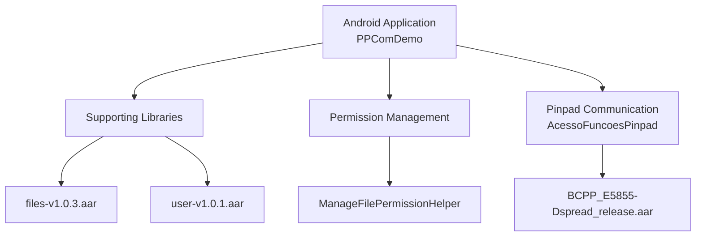
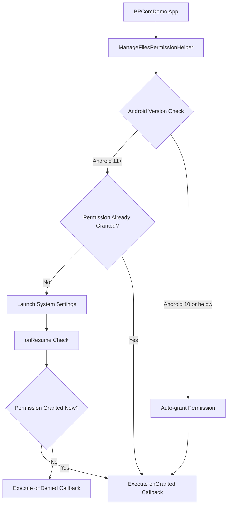
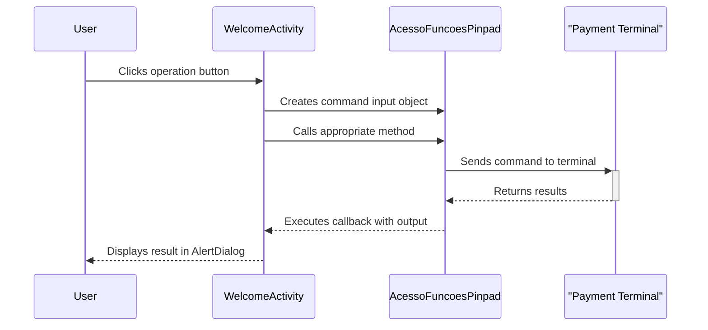
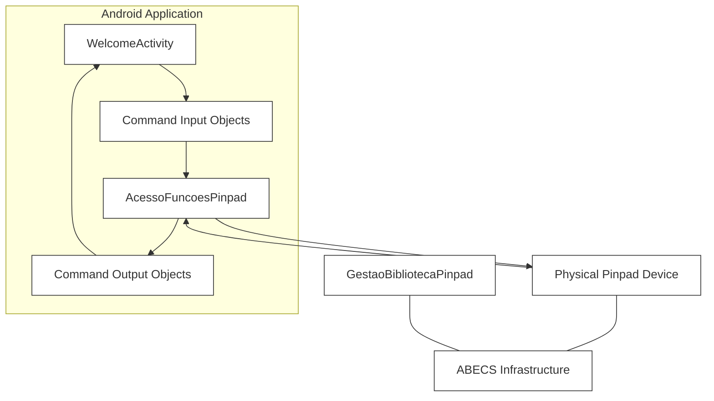
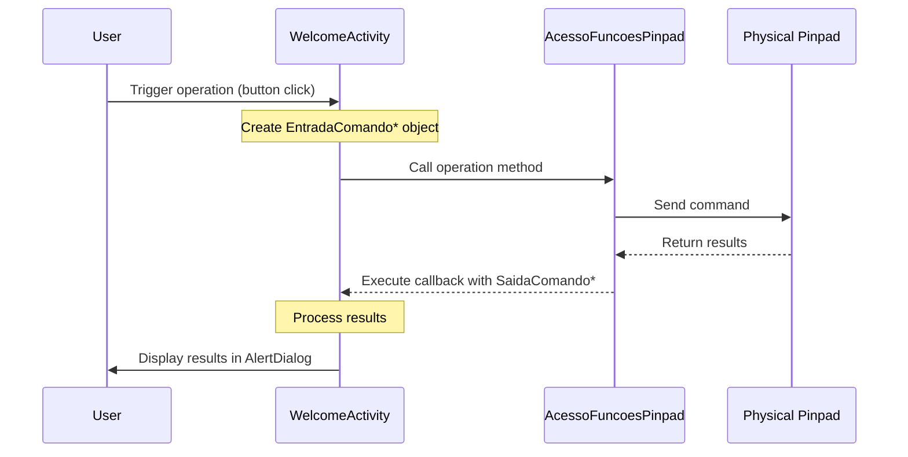

# Introduction

PPComLibrary is an Android library project for payment terminal integration based on the Abecs protocol. It provides comprehensive PIN pad communication and EMV transaction functionalities, enabling seamless integration with payment terminals and handling various payment processing tasks.

This document introduces the system architecture, core components, developemet environment, integration process of Android ABECS Demo ,and developemet guide. For more information, please refer to the corresponding chapters:

- For system architecture part, see [System Architecture](#system-architecture).
- For core components part, see [Core Components](#core-components).
- For build environment part, see [Build Environment](#build-environment).
- For integration flow part, see [Integration Flow](#integration-flow).
- For developemet guide part, see [Developemet Guide](https://github.com/DspreadOrg/android-abecsdemo/blob/main/Development-Guide.md).


## System Architecture

The Android ABECS Demo consists of several interconnected components that work together to complete payment and related management operations.



### Project directory structure
```
Abecsdemo/  
├── app/                           # Main application module  
│   ├── src/  
│   │   ├── main/  
│   │   │   ├── java/              # Java source code  
│   │   │   │   └── com/dspread/ppcomlibrary/  # Main package  
│   │   │   │       ├── ui/        # UI components  
│   │   │   │       ├── BaseAppliction.java    # Application base class  
│   │   │   │       ├── Formato.java           # Data format definitions  
│   │   │   │       ├── Geral.java             # Constants definitions  
│   │   │   │       ├── InterfaceUsuario.java  # User interface implementation  
│   │   │   │       ├── ManageFilesPermissionHelper.java # File permission management  
│   │   │   │       ├── Parametro.java         # Parameter definitions  
│   │   │   │       ├── Tables.java            # AID and CAPK table management  
│   │   │   │       ├── Tipo.java              # Type definitions  
│   │   │   │       └── WelcomeActivity.java   # Main interface activity
│   │   │   ├── res/               # Resource files  
│   │   │   │   ├── layout/        # Layout files  
│   │   │   │   │   └── activity_welcome.xml   # Main interface layout  
│   │   │   │   ├── values/        # Value resources
│   │   │   └── AndroidManifest.xml # Application manifest file
│   ├── libs/                      # Dependency libraries  
│   │   ├── BCPP_E5855-Dspread_release.aar    # Dspread SDK library 
│   │   ├── files-v1.0.3.aar                  # File operation library  
│   │   └── user-v1.0.1.aar                   # User-related library
│   ├── build.gradle               # Application module build configuration  
│   └── proguard-rules.pro         # ProGuard rules  
├── gradle/                        # Gradle wrapper files  
│   └── wrapper/
├── build.gradle                   # Project build configuration  
└── gradlew                        # Gradle startup script  
```

## Core Components
### 1. Permission Management
The Permission Management system handles Android file system access permissions, which are necessary for the application to read and write configuration files, logs, and other data. The ManageFilesPermissionHelper class simplifies the process of requesting and checking for the MANAGE_EXTERNAL_STORAGE permission on Android 11 and above.



### 2. Pinpad Communication System
The Pinpad Communication module centers around the AcessoFuncoesPinpad class which provides an interface to interact with payment terminals. This component handles various payment terminal operations including:

- Opening/closing connections
- Card data capture
- PIN entry
- EMV chip card transactions
- Contactless card processing
- EMV Table Management
- Other

The WelcomeActivity class serves as the demonstration interface, providing buttons to trigger different pinpad operations and display their results.



#### 2.1 Supported Operations of Pinpad Communication System

The Android ABECS Demo supports a comprehensive set of payment terminal operations, demonstrated through the interactive interface in WelcomeActivity:


| Operation | Description | Method |
|-----------|-------------|---------|
| Open | Establishes connection with the pinpad | `acessoFuncoes.open()` |
| GetCard | Reads card information | `acessoFuncoes.getCard()` |
| GetPin | Captures PIN entry | `acessoFuncoes.getPin()` |
| GoOnChip | Processes EMV chip transactions | `acessoFuncoes.goOnChip()` |
| FinishChip | Completes EMV transaction | `acessoFuncoes.finishChip()` |
| CheckEvents | Monitors card insertion/removal | `acessoFuncoes.checkEvent()` |
| TableLoad | Loads EMV configuration tables | `acessoFuncoes.tableLoad()` |
| EncryptBuffer | Encrypts sensitive data | `acessoFuncoes.encryptBuffer()` |
| RemoveCard | Prompts for card removal | `acessoFuncoes.removeCard()` |
| ChipDirect | Direct communication with chip card | `acessoFuncoes.chipDirect()` |
| Close | Terminates pinpad connection | `acessoFuncoes.close()` |


## Development Environment
The project is built using:

- Gradle build system
- Java Or Kotlin programming languages
- AAR libraries for specialized functionality:
- BCPP_E5855-Dspread_release.aar
- files-v1.0.3.aar
- user-v1.0.1.aar



## Integration Flow
The integration mainly includes the creation of Welcome activity and the call of related methods of AcessoFuncoesPinpad

### 1. Create WelcomeActivity
The WelcomeActivity serves as the main interface for the Android ABECS Demo. It provides buttons for triggering various pinpad operations, such as GetCard, GetPin, GoOnChip, FinishChip, and more. Each button click triggers the corresponding operation in the AcessoFuncoesPinpad class.

### 2. Call the method of  AcessoFuncoesPinpad class
This component serves as the communication bridge between the application and the physical pinpad device. It:

- Exposes methods for all supported pinpad operations
- Manages the underlying protocol details
- Handles command transmission and response processing
- Is instantiated through GestaoBibliotecaPinpad


#### 2.1Command Input/Output Objects
All pinpad operations use specific input and output command objects:


| Operation | Input Object | Output Object | Purpose |
|-----------|--------------|---------------|----------|
| Open | `EntradaComandoOpen` | _(via callback)_ | Establish connection with pinpad |
| GetCard | `EntradaComandoGetCard` | `SaidaComandoGetCard` | Retrieve card information |
| GetPin | `EntradaComandoGetPin` | `SaidaComandoGetPin` | Capture PIN entry |
| GoOnChip | `EntradaComandoGoOnChip` | `SaidaComandoGoOnChip` | Process EMV chip transaction |
| FinishChip | `EntradaComandoFinishChip` | `SaidaComandoFinishChip` | Complete EMV transaction |
| CheckEvent | `EntradaComandoCheckEvent` | `SaidaComandoCheckEvent` | Monitor for card events |
| TableLoad | `EntradaComandoTableLoad` | _(via callback)_ | Load EMV configuration tables |
| EncryptBuffer | `EntradaComandoEncryptBuffer` | `SaidaComandoEncryptBuffer` | Encrypt sensitive data |
| RemoveCard | `EntradaComandoRemoveCard` | _(via callback)_ | Prompt for card removal |
| ChipDirect | `EntradaComandoChipDirect` | `SaidaComandoChipDirect` | Send APDU commands to chip |
| Close | `EntradaComandoClose` | _(via callback)_ | Terminate pinpad connection |

### 3. Operation Flow
All pinpad operations follow a common pattern:



## Developemet Guide
- For developemet guide details, please see [Developemet Guide](https://github.com/DspreadOrg/android-abecsdemo/blob/main/Development-Guide.md).
